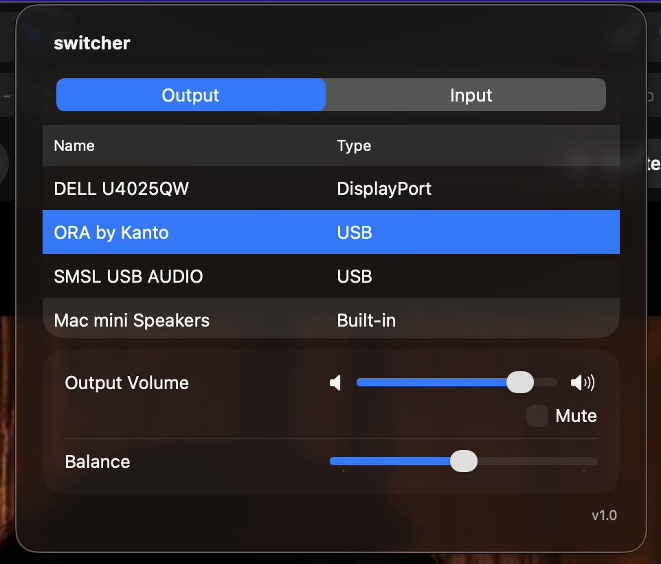

# switcher



menubar app to manage audio inputs/outputs on the fly without having to
go into settings menu

## local install

```bash
# from the root directory build and sign the app via the following commands
xcodebuild -configuration Release -scheme switcher
codesign  --timestamp \
          --options runtime \
          --sign "Developer ID Application: Your Name" \
          --deep \
          "build/Release/switcher.app"

# misc helper commands
xcodebuild -configuration Release -list

```
