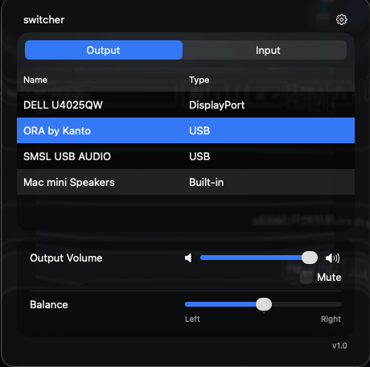
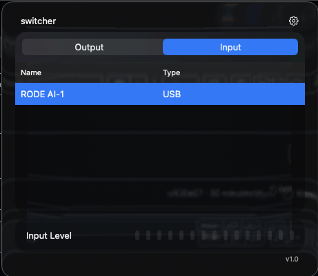
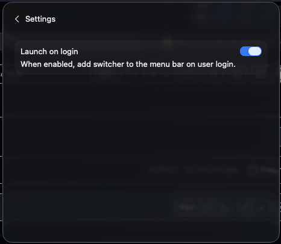

# switcher





Menubar app to manage audio inputs/outputs on the fly without having to
go into settings menu and reflects current device state if changed from
anywhere in the system.

Currently supports normal macOS system controls for most USB audio devices
and prompts user to add it as a startup item, some things to look into later:

- controlling volume on monitors with built-in speakers (likely involves
  DDC/CI protocol shenanigans).
- controlling input volume for various BLE headsets like airpods
- general testing of various devices (i.e, speakers that support surround
  sound (preliminary support is there, service class checks for channel
  layout of device).
- considering adding sound mixing support per application, will cease to be
  a menubar only app at that point though.

## local install

```bash
# from the root directory build and sign the app via the following commands
xcodebuild -configuration Release -scheme switcher

# misc helper commands
xcodebuild -configuration Release -list

```
